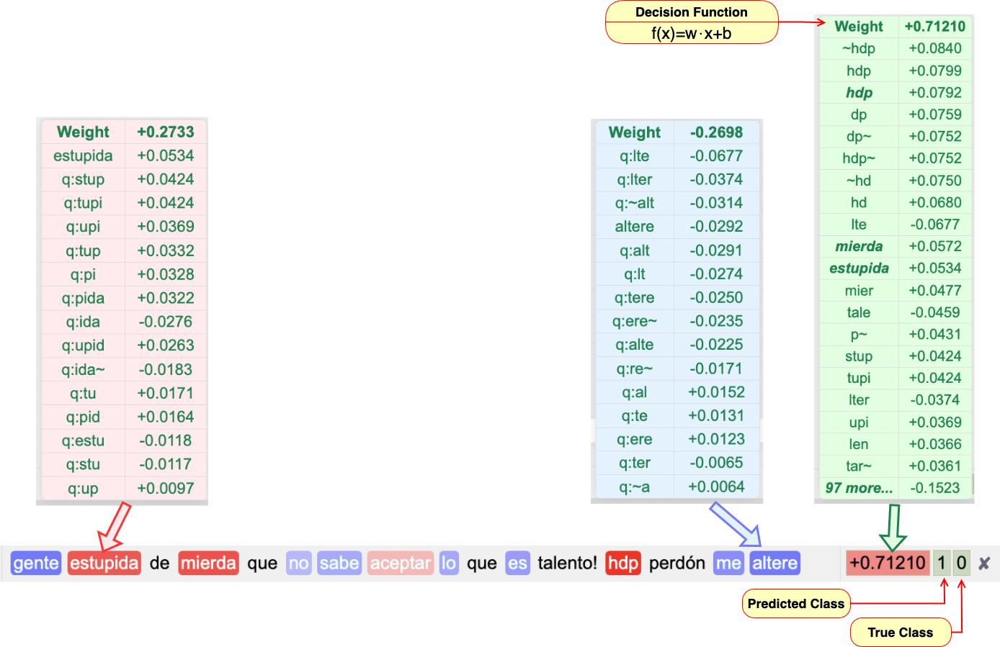

# LinearGEX: A Symbolic Pre-hoc Framework for Gram-based EXplainability in Short-Text NLP

<!-- [](link_to_preprint_or_paper) -->  
[](LICENSE)

LinearGEX is a **pre-hoc explainability framework** for sparse-text NLP tasks.  
It combines **q-gram tokenization**, **linear classifiers**, and a **deterministic gram-to-word tracing mechanism** to provide efficient, human-readable, and scalable token-level explanations.  

This repository contains the implementation, experimental notebooks, and supplementary materials for the manuscript:

> *LinearGEX: A Symbolic Pre-hoc Framework for Gram-based EXplainability in Sparse-Text NLP*  
> José J. Calderón-Ochoa, Mario Graff, Eric S. Téllez

---

## 🚀 Features
- **Pre-hoc interpretability**: explanations are intrinsic to the model, not post-hoc approximations.  
- **Gram-to-word tracing**: reconstructs human-readable tokens from q-gram coefficients with fidelity ($R^2 = 1$).  
- **Efficiency**: explanations in microseconds per instance, scalable to corpus-level heatmaps.  
- **Compatibility**: designed for sparse linear models (LinearSVC + TF-IDF q-grams).  
- **Visualization**: batch-level heatmaps and JSON exports for auditing, annotation, or downstream tools.  

---

## 🏗️ Prototype Architecture
The LinearGEX prototype integrates six sequential stages:

1. **Input Processing**: Raw short texts (tweets, comments) are normalized while preserving token boundaries.  
2. **Q-gram Tokenization**: Words are decomposed into overlapping character q-grams. <!-- ($q \in \{2,3,4\}$). --> 
3. **TF–IDF Weighting**: Sparse weighting highlights informative substrings across the corpus.  
4. **Linear Estimation**: A linear model (e.g., LinearSVC) learns coefficients for each q-gram.  
5. **Deterministic Gram→Word Tracing**: Contributions from q-grams are aggregated into word-level scores, ensuring exact reconstruction of the model margin.  
6. **Visual Explanation**: Token-level heatmaps and batch-level visualizations reveal recurrent patterns, dataset biases, or model errors.

This architecture allows **real-time, corpus-wide analysis** of explanations, something impractical for post-hoc methods like SHAP or LIME.

**Visual Explanation**: Token-level heatmaps and batch-level visualizations reveal recurrent patterns.

The figure below illustrates how LinearGEX reconstructs word-level relevance from q-grams and visualizes it in an interpretable heatmap.

<p align="center">
  
</p>

<p align="center"><em>Figure: Example of token-level heatmap produced by LinearGEX.</em></p>

---
## 💻 Implementation and Experiments

The LinearGEX prototype is developed in **Python** using the **Flask** framework, providing a lightweight web-based interface to visualize token-level explanations, explore batch heatmaps, and export structured JSON relevance data.  

Alongside the prototype, the repository includes **Jupyter notebooks** under [`experiments/`](./experiments) that reproduce the controlled Colab experiments described in Section 4 of the manuscript. These notebooks implement dataset loaders, µTC tokenization + TF–IDF pipelines, LinearSVC/BERT models, and explainability runners for SHAP, LIME, and LinearGEX.  

The experiments evaluate:  
- **Fidelity** ($R^2$ on native outputs: margins for LinearSVC, logits for BERT, surrogate fit for LIME).  
- **Auxiliary metrics** (MAE for SHAP/LinearGEX, STD for LIME).  
- **Runtime and scalability** (per-instance time, batch size, batch runtime).  

Results are exported as CSV tables consistent with **Table 5** of the paper.

---

## ⚙️ Installation
Clone the repository:
```bash
git clone https://github.com/JuanCalderon/LinearGEX.git
cd LinearGEX
